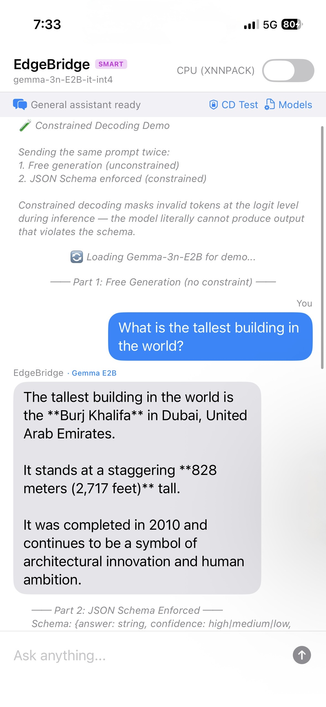
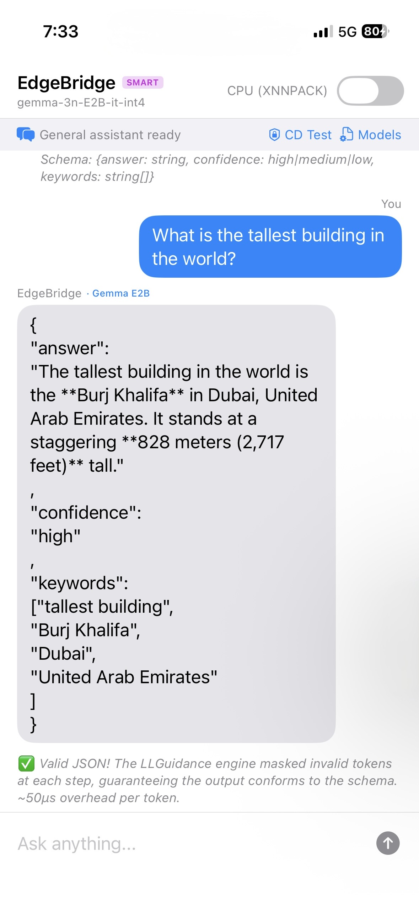

# EdgeBridge

**On-device LLM inference for iOS with agentic tool calling, dual-model cascade routing, fine-tuned calendar intelligence, and constrained decoding — all running locally on an iPhone with zero cloud dependencies.**

EdgeBridge is a native iOS application that runs 3-billion-parameter language models entirely on-device using Google's [LiteRT-LM](https://github.com/google-ai-edge/LiteRT-LM) C++ inference framework, cross-compiled from source for iOS `arm64` via Bazel. The app implements an agentic calendar assistant that performs real-time tool calling against Apple's EventKit, a dual-model cascade architecture with automatic query routing, and constrained decoding infrastructure backed by Microsoft's LLGuidance — all without any network connection.

> **Demo:** See [`demo.mov`](demo.mov) for a walkthrough of Smart Mode in airplane mode — the user greets the assistant (routed to Gemma for general conversation), then asks about their schedule (automatically routed to the fine-tuned Qwen calendar agent with live EventKit tool calls).

<div align="left">

| Demo |
| :---: |
| <video src="https://github.com/user-attachments/assets/cc468bb7-ede0-4dc0-b43f-71766f89a00d" width="300" controls> </video> |

</div>

---

## Table of Contents

- [Motivation](#motivation)
- [Architecture Overview](#architecture-overview)
- [Technical Deep Dive](#technical-deep-dive)
  - [1. Building LiteRT-LM from Source for iOS](#1-building-litert-lm-from-source-for-ios)
  - [2. Swift/C++ Interop via Pure C Bridge](#2-swiftc-interop-via-pure-c-bridge)
  - [3. Agentic Calendar Tool Calling](#3-agentic-calendar-tool-calling)
  - [4. Fine-Tuning Pipeline](#4-fine-tuning-pipeline)
  - [5. Constrained Decoding](#5-constrained-decoding)
  - [6. Dual-Model Cascade Architecture](#6-dual-model-cascade-architecture)
  - [7. GPU Acceleration Toggle](#7-gpu-acceleration-toggle)
- [Test Results](#test-results)
- [Project Structure](#project-structure)
- [Build and Run](#build-and-run)

---

## Motivation

Mobile applications are shifting from cloud-dependent API wrappers to autonomous, on-device AI agents. Running LLMs natively on mobile hardware provides three critical advantages:

1. **Zero latency** — no network roundtrips, enabling real-time streaming and seamless UX
2. **Absolute privacy** — user data never leaves the device
3. **Zero cloud cost** — compute is offloaded to the user's hardware

However, achieving this on iOS presents a significant systems engineering challenge. Google's [LiteRT-LM](https://github.com/google-ai-edge/LiteRT-LM) framework provides high-performance C++ inference for on-device models and does list iOS as a supported platform with Bazel build configs. But the iOS developer experience is still maturing — the Swift SDK is listed as "In Dev" (not stable), the documentation is Android-first, and there is no high-level Swift API equivalent to the Android/Kotlin SDK. Building a production-quality agentic app required compiling LiteRT-LM from source, writing a custom C interop bridge (since the Swift SDK isn't ready), solving non-trivial linking challenges with mixed C++/Rust static archives, fine-tuning a model for reliable tool calling, and designing the multi-model architecture from scratch.

EdgeBridge bridges this gap.

---

## Architecture Overview

```
                              ┌────────────────────────────────────┐
                              │           EdgeBridge App           │
                              │         (SwiftUI / Swift)          │
                              └──────────────┬─────────────────────┘
                                             │
                              ┌──────────────▼─────────────────────┐
                              │     EngineViewModel (Swift)        │
                              │  ┌───────────────────────────────┐ │
                              │  │    Keyword Router             │ │
                              │  │  "schedule" → Calendar Model  │ │
                              │  │  "hello"    → General Model   │ │
                              │  └───────────┬───────────────────┘ │
                              │              │                     │
                      ┌───────┴──────────────┴──────────────┐      │
                      │                                     │      │
           ┌──────────▼──────────┐           ┌──────────────▼────┐ │
           │  Qwen 3B            │           │  Gemma 3n E2B     │ │
           │  (fine-tuned)       │           │  (general)        │ │
           │  Calendar Agent     │           │  Conversation +   │ │
           │  + Tool Calling     │           │  Constrained Dec. │ │
           └──────────┬──────────┘           └───────────────────┘ │
                      │                                            │
           ┌──────────▼──────────┐                                 │
           │  Agentic Tool Loop  │                                 │
           │  ┌────────────────┐ │                                 │
           │  │ Parse tool call│ │                                 │
           │  │ Execute via    │ │                                 │
           │  │ EventKit       │◄├──── CalendarToolExecutor ───────┘
           │  │ Send result    │ │     (8 tools, real calendar)
           │  │ Loop until done│ │
           │  └────────────────┘ │
           └─────────────────────┘
                      │
    ┌─────────────────▼──────────────────┐
    │          litert_bridge_api.h        │
    │       Pure C API (12 functions)     │
    │    Opaque handles, C enums only     │
    └─────────────────┬──────────────────┘
                      │ extern "C"
    ┌─────────────────▼──────────────────┐
    │           LiteRT-LM C++            │
    │   Cross-compiled for iOS arm64     │
    │  ┌─────────┐  ┌──────────────────┐ │
    │  │ XNNPACK │  │ LLGuidance       │ │
    │  │ (CPU)   │  │ (constrained     │ │
    │  │         │  │  decoding, Rust) │ │
    │  └─────────┘  └──────────────────┘ │
    │  libLiteRTLM.a  libLiteRTLM_rust.a │
    └────────────────────────────────────┘
```

**Three models, two modes:**

| Model | Size | Role | Mode |
|-------|------|------|------|
| `calendar-qwen25-3b_q8_ekv4096.litertlm` | ~3 GB | Calendar tool calling (fine-tuned) | Smart + Individual |
| `gemma-3n-E2B-it-int4.litertlm` | ~3.7 GB | General conversation + constrained decoding | Smart + Individual |
| `Qwen2.5-3B-Instruct.litertlm` | ~3 GB | Base pretrained (for comparison) | Individual only |

- **Smart Mode**: Keyword router auto-detects calendar vs. general queries and hot-swaps models on demand. Only one model occupies memory at a time (~3 GB).
- **Individual Mode**: Manual model selection from a picker sheet for testing or comparison.

---

## Technical Deep Dive

### 1. Building LiteRT-LM from Source for iOS

LiteRT-LM does officially list iOS as a supported platform, and the Bazel build system includes `--config=ios_arm64` build targets. However, there is no high-level Swift SDK yet (it's listed as "In Dev"), the documentation is Android/Kotlin-first, and the repo does not provide a turnkey "build and integrate into your Xcode project" workflow. The work here was in actually building the framework from source, solving the linking challenges that arise from its mixed C++/Rust codebase, and integrating the result into an Xcode project manually.

#### Why Build from Source

LiteRT-LM's prebuilt iOS artifacts are limited — for example, `libGemmaModelConstraintProvider.dylib` is available prebuilt for `ios_arm64`, but the core inference library itself needs to be compiled from source to produce the static archives that Xcode can link against. There is no prebuilt `.xcframework` or CocoaPod for the core engine. Building from source was the path to getting the full inference stack into an iOS app.

#### Bazel Cross-Compilation

Building the core library:

```
bazel build //runtime:litert_lm_lib --config=ios_arm64
```

On macOS 26 (Tahoe), this hit a compatibility issue: Bazel's Apple rules couldn't detect the new OS version, causing the build to fail before compilation started. The fix required a `.bazelrc.user` with explicit SDK version overrides:

```
build --macos_sdk_version=15.5
build --host_platform=@build_bazel_rules_apple//apple/platforms:catalyst_arm64
```

The build also pulls a **Rust toolchain** (`rust_macos_aarch64`) because LiteRT-LM's constrained decoding subsystem (LLGuidance) and its tokenizer library are written in Rust. Bazel handles the Rust cross-compilation automatically, but the resulting artifacts create the linking challenge described below.

#### Static Archive Assembly — The Dual-Archive Solution

The Bazel build produces approximately **3,000 `.o` files** (C++ object files) and **80 `.a` archives** (Rust crate archives). The naive approach — running `libtool` on everything — produces **15,987 duplicate symbol errors** because the Rust `.o` files exist both inside the `.a` archives and as standalone objects.

The solution is a **dual-archive strategy** that separates C++ and Rust artifacts:

| Archive | Contents | Xcode Linking |
|---------|----------|---------------|
| `libLiteRTLM.a` (~77 MB) | C++ `.o` files only (excluding Rust paths) | `-force_load` (all symbols needed) |
| `libLiteRTLM_rust.a` (~42 MB) | Rust `.a` archives only (crate_index, tokenizers_cpp, tool_use, etc.) | Normal linking (linker pulls only needed symbols) |

The `-force_load` flag on the C++ archive ensures all symbols are included (LiteRT-LM uses static registration patterns that the linker would otherwise strip). The Rust archive is linked normally, which allows the linker to resolve only the symbols actually referenced — eliminating all 15,987 duplicates.

This was the hardest part of the iOS integration. The LiteRT-LM build system is designed to produce a single linked binary or Android AAR, not a set of static archives for manual Xcode integration. Figuring out which objects belonged to C++ vs. Rust, and that they needed different linking strategies, required inspecting the Bazel build graph and the contents of each archive.

#### Xcode Integration

The final Xcode project configuration:

- **Bridging Header**: includes only `litert_bridge_api.h` — the single C header that hides all C++ complexity
- **Other Linker Flags**: `-force_load $(PROJECT_DIR)/Libs/libLiteRTLM.a`, `-lc++`, `-lz`
- **Embedded Libraries**: `libGemmaModelConstraintProvider.dylib` (Embed & Sign) — the constrained decoding runtime plugin
- **Frameworks**: Accelerate, Metal, MetalPerformanceShaders, CoreML, AVFoundation, AudioToolbox
- **Entitlements**: `com.apple.developer.kernel.increased-memory-limit` — required for loading ~3 GB models into memory
- **Info.plist**: `UIFileSharingEnabled` — allows users to transfer `.litertlm` model files to the app via Finder/iTunes

---

### 2. Swift/C++ Interop via Pure C Bridge

LiteRT-LM's Swift SDK is listed as "In Dev" and is not yet available. Two alternatives were evaluated:

1. **Swift 5.9 direct C++ interop** — abandoned because LiteRT-LM's headers transitively include `absl`, `protobuf`, `nlohmann/json`, `XNNPACK`, and other heavy C++ dependencies with complex template metaprogramming that Swift's C++ bridge cannot handle
2. **Pure C API bridge** — adopted. This is the standard approach used by production frameworks like Core ML and TensorFlow Lite's C API

The bridge (`litert_bridge_api.h` / `litert_bridge_api.cc`) hides all C++ complexity behind 12 `extern "C"` functions. Swift sees only opaque `void*` handles and C enums.

```c
// Opaque handle types — callers never see the C++ internals
typedef void* LiteRTEngineHandle;
typedef void* LiteRTConversationHandle;

// Engine lifecycle
LiteRTStatus litert_engine_create(const char* model_path,
                                   LiteRTBackend backend,
                                   LiteRTEngineHandle* engine_out);
void litert_engine_destroy(LiteRTEngineHandle engine);

// Conversation lifecycle
LiteRTStatus litert_conversation_create(LiteRTEngineHandle engine,
                                         const char* system_prompt,
                                         const char* tools_json,
                                         LiteRTConversationHandle* conversation_out);

// Messaging
LiteRTStatus litert_conversation_send(LiteRTConversationHandle conversation,
                                       const char* user_message,
                                       const char** response_out);

// Constrained decoding
LiteRTStatus litert_conversation_send_constrained(
    LiteRTConversationHandle conversation,
    const char* user_message,
    LiteRTConstraintType constraint_type,
    const char* constraint_string,
    const char** response_out);

// Tool response handling
LiteRTStatus litert_conversation_send_tool_response(
    LiteRTConversationHandle conversation,
    const char* tool_result_json,
    const char** response_out);

// Performance metrics
LiteRTStatus litert_get_benchmark_info(LiteRTConversationHandle conversation,
                                        LiteRTBenchmarkInfo* info_out);
```

The bridge also defines:
- `LiteRTBackend` enum (`CPU`, `GPU`) for backend selection
- `LiteRTStatus` enum with 5 error codes for all API functions
- `LiteRTConstraintType` enum (`NONE`, `JSON_SCHEMA`, `REGEX`, `LARK`) mapping to LLGuidance constraint types
- `LiteRTBenchmarkInfo` struct with TTFT, prefill tok/s, decode tok/s, and token counts
- `LiteRTStreamCallback` function pointer type for streaming token-by-token output

In the Xcode project, the bridging header (`EdgeBridge-Bridging-Header.h`) contains a single line: `#include "litert_bridge_api.h"`. This is the only LiteRT-LM header the Swift compiler ever sees.

---

### 3. Agentic Calendar Tool Calling

The fine-tuned Qwen model operates as an autonomous agent that can chain multiple tool calls in a single user interaction. The agentic loop runs entirely on-device with real EventKit data.

#### Tool Loop Architecture

```
User message
  │
  ▼
EngineViewModel.sendMessage()
  │
  ├─ Prepend [Context: ...] block (date/time + system instructions)
  │
  ▼
litert_conversation_send()  ──►  Model inference (XNNPACK)
  │
  ▼
Response contains "tool_calls"?
  │
  ├─ YES ─► parseToolCalls() ──► CalendarToolExecutor.executeSync()
  │         │                          │
  │         │                     EventKit API
  │         │                          │
  │         ◄──── tool result JSON ◄───┘
  │         │
  │         ▼
  │    litert_conversation_send_tool_response()
  │         │
  │         ▼
  │    New model response ──► loop back to "tool_calls" check
  │
  └─ NO ──► Display final response to user
```

Each iteration of the loop renders a **tool call card** (orange accent bar, showing what the model is doing) and a **tool result card** (green accent bar, showing the EventKit response) in the chat UI before proceeding to the next inference. This uses `await MainActor.run` with a 100ms `Task.sleep` to give SwiftUI a render cycle before XNNPACK saturates the CPU.

#### The 8 Calendar Tools

All tools are declared as JSON schemas in `ToolDeclarations.swift` and passed to `litert_conversation_create()`, which feeds them into LiteRT-LM's Jinja template engine for proper ChatML formatting.

| Tool | Description | Multi-Step Chains |
|------|-------------|-------------------|
| `get_events` | Events on a specific date (supports "today", "tomorrow", "next monday", YYYY-MM-DD) | Source for `create_event` (duplicating) |
| `get_week_events` | Weekly overview grouped by day | Standalone |
| `find_free_slots` | Available time windows (8 AM - 8 PM) with configurable duration | Feeds into `create_event` |
| `create_event` | Full event creation: title, time, location, notes, calendar selection | Terminal action |
| `modify_event` | Update title, time, or location of an existing event (requires `event_id`) | Follows `search_events` |
| `delete_event` | Remove an event by ID | Follows `search_events` |
| `search_events` | Keyword search across title, location, notes over N days | Feeds into `modify_event` or `delete_event` |
| `check_conflicts` | Detect scheduling overlaps for a proposed time slot | Gates `create_event` |

#### Context Injection

The system prompt is dynamically generated at runtime with the current date, time, and day of week. This context is wrapped in a `[Context: ...]` block and prepended to the user's first message — matching the exact format the model was fine-tuned on:

```
[Context: Current date and time: 2026-03-22T14:30:00
Day of week: Sunday
You are an intelligent calendar assistant running entirely on this device...]

What's on my calendar tomorrow?
```

This format matching between training data and runtime is critical — any deviation (e.g., putting context in a system message instead of prepending to the user message) causes the model to ignore the tools entirely.

#### Sync vs. Async Execution

`CalendarToolExecutor` provides both `execute()` (async) and `executeSync()` (synchronous) paths. The sync path was added after discovering a **DispatchSemaphore deadlock** in Swift's cooperative thread pool. The original code used `DispatchSemaphore` inside a `Task.detached` block to bridge async EventKit calls to synchronous tool execution. This deadlocked because Swift's cooperative thread pool has a fixed number of threads, and blocking one with a semaphore while waiting for another async task on the same pool creates a circular dependency. The fix: since EventKit's calendar query APIs are actually synchronous, the `executeSync()` path calls them directly without any async/await or semaphore bridging.

---

### 4. Fine-Tuning Pipeline

The base `Qwen2.5-3B-Instruct` model can call tools but is unreliable — it selects wrong tools, produces malformed arguments, and hallucinates event details. Fine-tuning made it consistently correct across all 15 test scenarios.

#### Dataset Generation (`generate_calendar_dataset.py`)

A Python script generates **1,360 training examples** across 10 generator functions:

| Generator | Count | Behavior |
|-----------|-------|----------|
| `gen_single_get_events` | 200 | Single-step schedule lookup |
| `gen_single_create_event` | 200 | Event creation with varying parameters |
| `gen_find_free_and_book` | 200 | Multi-step: find free slot, then create event |
| `gen_search_and_modify` | 200 | Multi-step: search for event, then modify it |
| `gen_check_conflicts_then_create` | 100 | Conditional: check conflicts, then create if clear |
| `gen_reschedule_event` | 100 | Multi-step: search for event, then reschedule |
| `gen_delete_event` | 100 | Multi-step: search for event, then delete |
| `gen_duplicate_events` | 100 | Multi-step: get events, then create copies on another date |
| `gen_weekly_overview` | 80 | Single-step weekly calendar view |
| `gen_no_tool_needed` | 80 | Conversations that don't require tool calls |

**Format Matching** is the most critical aspect of the training data. The dataset uses:
- **No system message** — the Jinja template defaults to "You are Qwen, created by Alibaba Cloud..." which matches what LiteRT-LM produces at runtime
- **`[Context: ...]` prepended to user messages** — identical to `EngineViewModel`'s runtime format
- **Tool arguments in ISO format** (`YYYY-MM-DDTHH:MM`) while display text uses human-readable format (`h:mm a`, `MMM d, yyyy`) — matching the `en_US_POSIX` locale formatters in `CalendarToolExecutor`. This matters because iOS `DateFormatter` with `.timeStyle = .short` produces `8:00\u{202f}AM` (narrow no-break space, Unicode U+202F between the time and AM/PM), while Python's `strftime` produces `8:00 AM` (regular space). The model was trained on regular spaces, so iOS-formatted tool results caused malformed timestamps. The fix: explicit format strings with `en_US_POSIX` locale, which guarantees ASCII-only formatting with regular spaces
- **90/10 train/eval split** via a metadata field

Each example simulates a random date/time context, generates realistic calendar events with varying combinations of titles, locations, notes, and calendars, and produces the complete multi-turn conversation including tool calls and tool results.

#### Training Configuration (`EdgeBridgeFunctionGemmaFineTuning.ipynb`)

Training was performed on Google Colab with the following configuration:

| Parameter | Value |
|-----------|-------|
| Base model | `Qwen/Qwen2.5-3B-Instruct` |
| Method | LoRA (Low-Rank Adaptation) |
| LoRA rank (r) | 16 |
| LoRA alpha | 32 |
| Target modules | `q_proj`, `k_proj`, `v_proj`, `o_proj`, `gate_proj`, `up_proj`, `down_proj` |
| Trainable parameters | 29.9M / 3.1B total (0.96%) |
| Epochs | 3 |
| Learning rate | 8e-6 (cosine schedule) |
| Batch size | 1 (per device) |
| Gradient accumulation | 16 steps |
| Optimizer | `paged_adamw_8bit` |
| Precision | bf16 |

The training script uses a **custom tokenization function** that:
1. Sanitizes HuggingFace-inferred `datetime` objects back to ISO strings
2. Applies the Qwen2.5 chat template with tool declarations
3. Creates labels that mask everything except assistant turns (using `<|im_start|>`/`<|im_end|>` ChatML markers)

#### Model Conversion Pipeline

```
Qwen2.5-3B-Instruct (HuggingFace)
  │
  ▼ LoRA fine-tuning (Colab)
  │
  ▼ Merge LoRA weights into base model
  │
  ▼ Push merged model to HuggingFace (amoghghadge/qwen2.5-3b-calendar-agent)
  │
  ▼ Convert via ai-edge-torch with dynamic_int8 quantization
  │
  ▼ Package as .litertlm bundle with:
  │   - qwen2p5 model type metadata
  │   - Jinja prompt template with tool-calling support
  │   - Tokenizer configuration
  │   - prefill_seq_len=512, kv_cache_max_len=4096
  │
  ▼ calendar-qwen25-3b_q8_ekv4096.litertlm (~3 GB)
```

The `.litertlm` metadata includes the complete Jinja tool-calling template that formats `<tool_call>` / `</tool_call>` XML tags, tool response handling, and ChatML markers. This template is baked into the model bundle so LiteRT-LM can properly format multi-turn tool-calling conversations at inference time.

#### Results

All 15 test cases pass on the fine-tuned model. The model was published to HuggingFace at [`amoghghadge/qwen2.5-3b-calendar-agent`](https://huggingface.co/amoghghadge/qwen2.5-3b-calendar-agent).

---

### 5. Constrained Decoding

Constrained decoding forces the model's output to conform to a formal specification (JSON Schema, regex, or Lark grammar) by masking invalid tokens at the logit level during inference. This operates below the level of prompting — the model literally cannot produce tokens that would violate the constraint.

#### How It Works

1. At each decoding step, **LLGuidance** (Microsoft's [`guidance-ai`](https://github.com/guidance-ai/llguidance) project) computes a **token mask** based on the constraint and the tokens generated so far
2. Before softmax and sampling, invalid tokens receive **-infinity logits**, making them impossible to select
3. The overhead is approximately **~50 microseconds per token** — negligible compared to the model inference time

This is fundamentally different from prompt engineering ("please output JSON") or post-processing (parsing and retrying). The output is **guaranteed** to conform to the schema on the first attempt.

#### C Bridge Support

The bridge API exposes constrained decoding through:

- `LiteRTConstraintType` enum: `NONE`, `JSON_SCHEMA`, `REGEX`, `LARK`
- `litert_conversation_create_ex()`: explicitly enables/disables the constrained decoding infrastructure
- `litert_conversation_send_constrained()`: per-message constraint application
- `litert_conversation_send_tool_response_constrained()`: constrained model replies after tool results

The runtime plugin `libGemmaModelConstraintProvider.dylib` provides the constraint enforcement. Despite its name (inherited from the LiteRT-LM codebase), it works at the tokenizer level and is model-agnostic — it functions with both Qwen and Gemma models.

#### A/B Demo

The "CD Test" button in the app runs an A/B comparison:

1. **Unconstrained**: Sends "What is the tallest building in the world?" to Gemma — model responds with natural language prose
2. **Constrained**: Sends the identical prompt with a JSON Schema forcing `{answer: string, confidence: "high"|"medium"|"low", keywords: string[2..4]}` — model produces valid JSON

The app validates the constrained output with `JSONSerialization` and displays a verdict confirming structural validity. This demonstrates that the constraint operates at the token level, not via prompting or post-processing.

---

### 6. Dual-Model Cascade Architecture

Smart Mode automatically routes user queries between two specialized models, maintaining only one model (~3 GB) in memory at any time.

#### Keyword Router

The router scans the user's message (case-insensitive) against a set of 30+ calendar-related keywords:

```swift
private let calendarKeywords: Set<String> = [
    "schedule", "calendar", "event", "events", "meeting",
    "appointment", "free", "busy", "available", "book",
    "create", "cancel", "reschedule", "today", "tomorrow",
    "this week", "next week", "morning", "afternoon", ...
]
```

- **Match found** → route to fine-tuned Qwen (calendar agent with tool calling)
- **No match** → route to Gemma (general conversation)

#### Model Hot-Swapping

When the router determines a different model is needed:

1. Current model's conversation and engine handles are destroyed
2. A system message ("Routing to Calendar Agent...") appears in the chat
3. New model is loaded via `litert_engine_create()` → `litert_conversation_create()`
4. XNNPACK initializes its compute kernels (5-15 seconds on first load, faster on subsequent loads)
5. The original user message is sent to the newly loaded model

#### Fallback Detection

The keyword router is intentionally broad, which means it sometimes routes non-calendar queries to Qwen (e.g., "What was the calendar date of the moon landing?" triggers on "calendar"). When this happens:

1. The agentic loop detects that Qwen responded **without invoking any tools**
2. A fallback bar appears: "Calendar model didn't use tools. Want a better answer from the general model?"
3. A **"Try Gemma"** button lets the user re-route the same query to the general model
4. The model switches, and Gemma provides a direct answer

This handles the inherent tension between recall (catching all calendar queries) and precision (not routing general queries to the calendar model).

#### Load Generation Counter (Race Condition Fix)

Rapid model switching can cause a race condition where a stale background load completes and overwrites handles from a newer load. The fix:

```swift
private var loadGeneration: Int = 0

func loadModel(path: String, role: ModelRole, useGPU: Bool) {
    loadGeneration += 1
    let myGeneration = loadGeneration  // Capture at start

    Task.detached {
        // ... long-running model load ...

        // Check before committing handles
        let stale = await MainActor.run { self.loadGeneration != myGeneration }
        if stale {
            litert_engine_destroy(engine)  // Discard stale load
            return
        }

        await MainActor.run {
            self.engineHandle = engine      // Safe to commit
            self.conversationHandle = conv
        }
    }
}
```

Every `cleanup()` or `loadModel()` call increments the counter. Background tasks capture the counter at start and check it before committing handles, ensuring stale loads are discarded.

#### Model Attribution

Every assistant response bubble displays which model produced it:
- **Qwen 3B (fine-tuned)** — green label
- **Qwen 3B (base)** — green label
- **Gemma E2B** — blue label

A purple **SMART** badge appears in the header when Smart Mode is active.

---

### 7. GPU Acceleration Toggle

The app UI includes a GPU toggle switch that is wired through the entire stack (`LiteRTBackend.GPU` → `litert_engine_create()` → Metal backend initialization), but currently falls back to CPU/XNNPACK at runtime. LiteRT-LM's platform support table lists GPU as supported on iOS, and the macOS prebuilt directory ships `libLiteRtMetalAccelerator.dylib`. However, the iOS prebuilt directory (`prebuilt/ios_arm64/`) does not include the Metal accelerator library — only `libGemmaModelConstraintProvider.dylib` is provided. It's possible the Metal backend works if built from source with the right Bazel targets, but I haven't confirmed this yet.

The toggle remains in the UI to:
1. Demonstrate that the architecture supports backend switching without Swift-side code changes
2. Be ready for activation once the iOS Metal accelerator library is available (either prebuilt or compiled from source)
3. Show awareness of the performance optimization path — Metal + Apple Neural Engine would significantly reduce inference latency compared to CPU-only XNNPACK

---

## Test Results

### Fine-Tuned Calendar Agent — All 15 Tests Pass

The fine-tuned Qwen 3B calendar agent was tested against 15 scenarios covering all 8 tools and multi-step chains. Each test was verified both in the EdgeBridge app and in the native iOS Calendar app.

#### Test 1: Basic Schedule Check
The agent queries today's calendar and returns 3 events with times, locations, and course details.


#### Test 2: Tomorrow's Schedule
Follow-up query for tomorrow's events. The model correctly interprets the relative date.


#### Test 3: Simple Event Creation
Creates "Team Standup" with computed end time from a natural language duration ("30 minutes").


#### Test 4: Event Creation with Location and Notes
Creates "iOS Deep Work" with location ("Library") and notes ("bring my charger") parsed from natural language. Verified in native iOS Calendar.

<p float="left">
  
  
</p>

#### Test 5: Event Creation with All Parameters
Creates "Dentist Appointment" with title, time, duration, location, notes, and specific calendar selection — all parsed from a single natural language instruction. Verified in native iOS Calendar with correct calendar assignment.

<p float="left">
  
  
</p>

#### Test 6: Find Free Slot and Book (Multi-Step)
The model chains `find_free_slots` → `create_event`: finds available 90-minute windows, then books "System Design Interview Prep" in the first open slot. Verified in native iOS Calendar.

<p float="left">
  
  
</p>

#### Test 7: Search and Modify Location (Multi-Step)
Chains `search_events` → `modify_event`: finds "System Design Interview Prep" by name, changes its location to "Online". Verified in native iOS Calendar.

<p float="left">
  
  
</p>

#### Test 8: Search and Modify Title (Multi-Step)
Chains `search_events` → `modify_event`: renames "System Design Interview Prep" to "Leetcode Practice". Verified in native iOS Calendar with all other properties preserved.

<p float="left">
  
  
</p>

#### Test 9: Search and Reschedule (Multi-Step with Error Recovery)
The model attempts to reschedule "Leetcode Practice" to 4 PM. It demonstrates resilience — after an initial failed modification (event not found with a placeholder ID), it falls back to `search_events` → `modify_event` and successfully reschedules. Verified in native iOS Calendar with preserved 90-minute duration.

<p float="left">
  
  
</p>

#### Test 10: Delete Event (Multi-Step)
Chains `search_events` → `delete_event`: finds and deletes "Leetcode Practice". Verified in native iOS Calendar — the event no longer appears.

<p float="left">
  
  
</p>

#### Test 11: Check Conflicts Then Create (Conditional Multi-Step)
Chains `check_conflicts` → `create_event`: verifies no scheduling overlaps at 2 PM tomorrow, then creates "Client Call". Verified in native iOS Calendar.

<p float="left">
  
  
</p>

#### Test 12: Weekly Overview
Retrieves and formats a multi-day calendar view with 6 events across 4 days, including course details and holidays. Verified against native iOS Calendar list view.

<p float="left">
  
  
  
</p>

#### Test 13: Forward Event Search
Searches for "Palm Sunday" in the next two weeks and correctly reports it falls on March 29, 2026. Verified in native iOS Calendar month view.

<p float="left">
  
  
</p>

#### Test 14: Out-of-Scope Query (No Tools Needed)
The agent correctly recognizes "What's the weather like?" is outside its capabilities and responds without invoking any tools.


#### Test 15: Greeting (No Tools Needed)
Responds to "Hello!" conversationally without unnecessary tool invocations.


---

### Base Model Failures — Why Fine-Tuning Was Necessary

The base `Qwen2.5-3B-Instruct` model demonstrates two failure modes that the fine-tuned model resolves:

#### Base Model Failure 1: Incorrect Date Reasoning
The base model retrieves calendar events correctly but labels the day of the week wrong — stating March 23 is "a Monday" when it is not.


#### Base Model Failure 2: Inability to Complete Multi-Step Tasks
Asked to "find a 90-minute opening and book" a session, the base model calls `get_events`, finds an empty calendar, and responds "there are no events scheduled" — failing to recognize that an empty schedule means maximum availability, and failing to proceed to the `create_event` step.


---

### Dual-Model Cascade Tests

#### Cascade Test 1: Automatic Model Routing
The user says "Hello" (routed to Gemma E2B for general conversation), then asks "What's on my calendar next Tuesday?" (automatically routed to the fine-tuned Qwen calendar agent). Model switching is transparent with system messages indicating the routing.


#### Cascade Test 2: Complex Task Routing + Conversational Follow-Up
A multi-step calendar task ("find a 90-minute opening and book System Design Interview Prep") is routed to Qwen, which completes the full tool-calling chain. The follow-up "Thanks!" is routed to Gemma for a conversational response.

<p float="left">
  
  
</p>

#### Cascade Test 3: Model Fallback Flow
The user asks "What was the calendar date of the moon landing?" — the keyword "calendar" triggers routing to Qwen, but the model recognizes it cannot answer with its calendar tools and responds without invoking them. The app detects the no-tool response and offers a "Try Gemma" button. Tapping it re-routes the query to Gemma, which provides a direct, cleaner answer.

<p float="left">
  
  
  
</p>

---

### Constrained Decoding A/B Demo

The same prompt ("What is the tallest building in the world?") is sent to Gemma twice. Part 1 produces free-form prose. Part 2 enforces a JSON schema — the model output is structurally valid JSON with `answer`, `confidence`, and `keywords` fields. The app validates the output and confirms: "Valid JSON! The LLGuidance engine masked invalid tokens at each step."

<p float="left">
  
  
</p>

---

## Project Structure

```
EdgeBridge/
├── README.md
├── demo.mov                              # Airplane mode demo video
├── .gitignore
│
├── EdgeBridge/                           # Xcode project root
│   ├── EdgeBridge.xcodeproj/             # Xcode project configuration
│   │
│   ├── EdgeBridge/                       # App source code
│   │   ├── EdgeBridgeApp.swift           # App entry point (@main)
│   │   ├── ChatView.swift                # Full UI — message bubbles, tool cards,
│   │   │                                 #   model picker, status bar, CD demo button
│   │   ├── ContentView.swift             # Unused default template (placeholder)
│   │   ├── EdgeBridge-Bridging-Header.h  # Single-line import of litert_bridge_api.h
│   │   ├── EdgeBridge.entitlements       # increased-memory-limit for ~3GB models
│   │   ├── Info.plist                    # UIFileSharingEnabled for model transfer
│   │   │
│   │   ├── Bridge/
│   │   │   └── EngineViewModel.swift     # Core engine — dual-model cascade, keyword
│   │   │                                 #   router, agentic tool loop, model lifecycle,
│   │   │                                 #   constrained decoding demo, fallback logic,
│   │   │                                 #   benchmark metrics, ChatMessage model,
│   │   │                                 #   ModelDiscovery utility
│   │   │
│   │   └── Tools/
│   │       ├── CalendarToolExecutor.swift # EventKit integration — 8 calendar tools,
│   │       │                             #   sync/async paths, date parsing, en_US_POSIX
│   │       │                             #   formatters (narrow no-break space fix)
│   │       └── ToolDeclarations.swift    # Tool JSON schemas, dynamic system prompt,
│   │                                     #   tool-call JSON schema for constrained decoding
│   │
│   └── Libs/                             # Pre-built native libraries
│       ├── litert_bridge_api.h           # Pure C API header (12 functions, v2)
│       ├── libLiteRTLM.a                 # C++ static archive (force-loaded, ~77MB)
│       ├── libLiteRTLM_rust.a            # Rust static archive (normal link, ~42MB)
│       └── libGemmaModelConstraintProvider.dylib  # Constrained decoding plugin (Embed & Sign)
│
├── FineTuning/                           # Model fine-tuning pipeline
│   ├── generate_calendar_dataset.py      # Training data generator (1,360 examples,
│   │                                     #   10 generators, format-matched to runtime)
│   ├── calendar_training_data.jsonl      # Generated training dataset (~10MB)
│   └── EdgeBridgeFunctionGemmaFineTuning.ipynb  # Colab notebook — LoRA training,
│                                         #   weight merging, HF upload, LiteRT conversion
│
└── Results/                              # Test screenshots & verification
    ├── FineTunedCalendarAgent/           # 15 test scenarios (26 images)
    │   ├── Test 1/  ... Test 15/         #   Each with app screenshot + iOS Calendar verification
    ├── BaseModelFailures/                # 2 failure cases demonstrating need for fine-tuning
    ├── ConstrainedDecoding/              # A/B demo — unconstrained vs. schema-enforced output
    ├── DualModelCascade/                 # 3 scenarios — routing, follow-up, fallback
    └── GemmaConversational/              # General conversation tests (placeholder)
```

---

## Build and Run

### Prerequisites

- Xcode 16+ with iOS 18 SDK
- Physical iPhone (simulator cannot run ~3 GB models)
- One or more `.litertlm` model files:
  - [`calendar-qwen25-3b_q8_ekv4096.litertlm`](https://huggingface.co/amoghghadge/qwen2.5-3b-calendar-agent) — fine-tuned calendar agent
  - `gemma-3n-E2B-it-int4.litertlm` — general conversation (for Smart Mode)
  - `Qwen2.5-3B-Instruct.litertlm` — base model (for comparison)

### Steps

1. **Clone the repository**
   ```bash
   git clone https://github.com/amoghghadge/EdgeBridge.git
   ```

2. **Open in Xcode**
   ```
   open EdgeBridge/EdgeBridge.xcodeproj
   ```

3. **Transfer model files** to the app's Documents directory via Finder (the app has `UIFileSharingEnabled`). Connect your iPhone, open Finder, select the device, go to the Files tab, and drag `.litertlm` files into the EdgeBridge app folder.

4. **Build and run** on a physical device. The app will:
   - Discover all `.litertlm` files in its Documents directory
   - Enable Smart Mode if both `calendar-qwen` and `gemma` models are found
   - Load the calendar model first and display "Calendar agent ready"
   - Grant calendar access on first launch (required for EventKit)

5. **Test in airplane mode** to verify zero cloud dependencies.

### Note on Static Archives

The `.gitignore` excludes `libLiteRTLM.a` and `libLiteRTLM_rust.a` due to their combined ~119 MB size. To build from source, you need to cross-compile LiteRT-LM for iOS `arm64` via Bazel as described in [Section 1](#1-cross-compiling-litert-lm-for-ios) and assemble the dual-archive structure.
